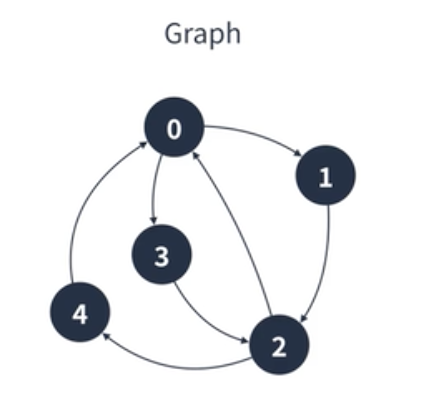

## BFS(너비 우선 탐색) / DFS (깊이 우선 탐색)

---

### BFS(너비 우선 탐색)

- 그래프 탐색 알고리즘으로 같은 깊이에 해당하는 정점부터 탐색하는 알고리즘
- 시작 지점에서 가까운 정점부터 탐색한다.
- V가 정점의 수, E가 간선의 수일 때 BFS의 시간복잡도는 O(V+E)다.
- 큐를 이용하여 구현할 수 있다.


$\rightarrow$ 이와 같은 경우에는 A (B C D) (E F) G 순서로 탐색함

```
Queue A
Queue B C D
Queue C D F (B를 dequeue하면서 B로부터 이동이 가능한 C, F 중 큐에 넣지 않은 F를 enqueue)
Queue D F
Queue F E
Queue E G
Queue G
```

---

### DFS (깊이 우선 탐색)

- 그래프 탐색 알고리즘으로 최대한 깊은 정점부터 탐색하는 알고리즘
- 시작 정점에서 깊은 것부터 찾는다
- V가 정점의 수, E가 간선의 수일 때 BFS의 시간복잡도는 O(V+E)다.
- stack을 이용하여 구현 가능


$\rightarrow$ A B F C G D E 순서로 탐색

```
stack A
stack A B
stack A B F
stack A B F C
stack A B F G
stack A
stack A D
stack A D E
```
