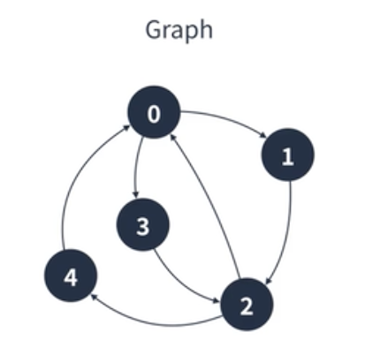

## 그래프

- 정점(노드)과 정점 사이를 연결하는 간선(엣지)으로 이루어진 비선형 자료구조
- 정점 집합과 간선 진합으로 표현할 수 있다.

ex. 인물관계도

---

### 그래프의 특징

- 정점은 여러 개의 간선을 가질 수 있다.
- 크게 방향 그래프와 무방향 그래프로 나눌 수 있다.
- 간선은 가중치를 가질 수 있다.
- 사이클(그래프의 정점과 간선의 부분 집합에서 순환이 되는 부분)이 발생할 수 있다.

---

### 그래프의 종류

1. 무방향 그래프 (ex. 양방향 통행 도로)

- 간선으로 이어진 정점끼리는 양방향으로 이동 가능
- (A,B)와 (B,A)는 같은 간선

2. 방향 그래프 (ex. 일방 통행)

- 간선에 방향성이 존재하는 그래프
- <A,B>와 <B,A>는 다른 간선

3. 연결 그래프 : 모든 정점이 서로 이동 가능한 그래프

4. 비연결 그래프 : 특정 정점쌍 사이에 간선이 존재하지 않는 그래프

5. 완전 그래프 : 모든 정점끼리 연결된 상태인 그래프
   - 한 정점에서 나오는 간선은 (정점 개수 - 1)개이다.
   - (정점개수 -1) \* 정점 개수 = 모든 간선 수

---

### 구현방법

<br/>



<br/>

1. 인접 행렬

```javascript
//이차원 그래프
const graph = Array.from( //Array.from : 반복 가능한 객체를 얕은 복사(원본과 메모리 주소가 같음)하여 새로운 객체를 만듦.
    Array(5), //행
    ()=> Array(5).fill(false);//열
)

graph[0][1] = true; //0->1
graph[0][3] = true; //0->3
graph[1][2] = true; //1->2
graph[2][0] = true; //2->0
graph[2][4] = true; //2->4
graph[3][2] = true; //3->2
graph[4][0] = true; //4->0
```

- 만약 가중치를 넣고 싶다면 false, true가 아니라 거기에 null(가중치가 0)과 가중치를 넣으면됨

2. 인접 리스트

```javascript
const graph = Array.from(Array(5), () => []);
graph[0].push(1);
graph[0].push(3);
graph[1].push(2);
graph[2].push(0);
graph[2].push(4);
graph[3].push(2);
graph[4].push(0);
```
